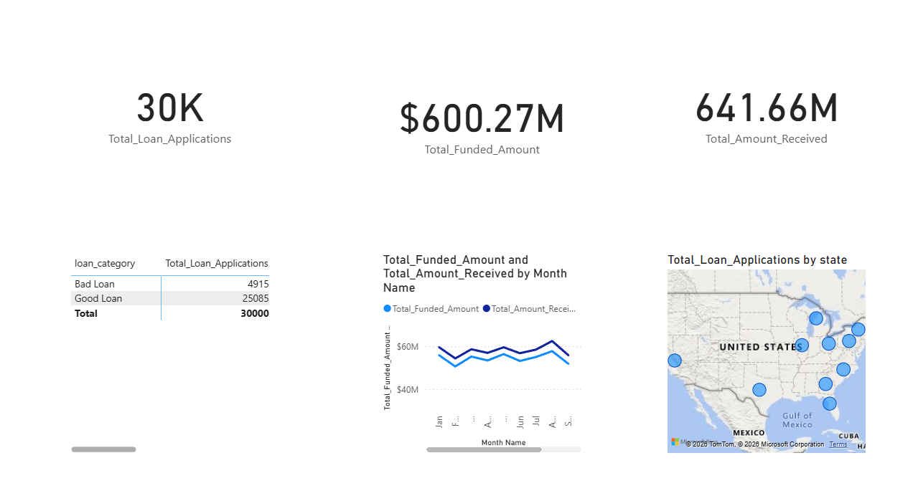

# Bank Loan Analysis Project Pipeline 📊🏦

An automated data engineering and analytics project built as part of the **SyntechX** Data Analytics Internship. This project features a complete pipeline starting from raw synthetic data generation and cleaning in Python to designing an interactive, dual-page executive dashboard in Power BI.

---

## 🖥️ Dashboard Preview
Niche hamare interactive Power BI dashboard ka main executive view hai:



---

## 📂 Project Structure
* 📁 **`src/`**: Contains the core Python automation pipeline.
  * `generate_data.py`: Script that generates 30,000 unique raw bank loan records.
  * `data_cleaning.py`: Implements robust data cleaning, formatting, and Good vs Bad Loan classification.
  * `loan_analytics.py`: Automates risk profiling, MoM growth calculations, and exports automated textual insights.
* 📁 **`dashboard/`**: Contains reporting and visualization assets.
  * `loan_analysis.pbix`: The main interactive Power BI Dashboard file.
  * `dashboard_preview.png`: Screenshot preview of the Power BI dashboard.
  * `python_insights_report.txt`: Automated text report generated via Python analytics backend.
  * `grade_risk_analysis.png`: Statistical visualization plot of credit grades vs risk profiles.
* 📁 **`data/`**: Storage folder for the pipeline dataset.
  * `raw_loan_data.csv`: Initial unstructured/generated records.
  * `cleaned_loan_data.csv`: Production-ready refined records.

---

## 🛠️ Tech Stack Used
* **Backend Automation:** Python 3.x (Pandas, NumPy, Matplotlib)
* **Business Intelligence & Visualization:** Power BI Desktop (DAX Modeling, Advanced Relationship Modeling)
* **Environment Management:** pip (Requirements tracking)

---

## 📊 Dashboard Key Features
### 1. Executive Summary Page
* **Core Financial KPIs:** Real-time metrics for Total Applications, Total Funded Amount, and Total Repayments Received.
* **Loan Classification Portfolio:** Clean breakdown of **Good Loans** vs **Bad Loans (Defaults)**.
* **Month-on-Month Trends:** Linear tracking of lending behavior and collection metrics from January to December.
* **Geographical Distribution:** High-level interactive US Map pointing out application densities across regions.

### 2. Risk Analytics Page
* **Risk Factors Mapping:** Purpose-driven bar charts profiling loan intents (Credit Card, Debt Consolidation, Small Businesses).
* **Credit Grade Risk Evaluation:** A 100% Stacked Column chart revealing risk expansion in lower-tier internal credit brackets (Grades A to F).
* **Employment Segment Matrix:** Deep-dive grid evaluating defaults based on job stability and tenure lengths.
* **Interactive Slicers:** Dynamic cross-filtering using customer Home Ownership properties (Own, Rent, Mortgage).

---

## ⚙️ How to Run Locally

1. **Clone this repository:**
```bash
   git clone [https://github.com/NishantKumar947/Syntecxhub_Bank_Loan_Analysis.git](https://github.com/NishantKumar947/Syntecxhub_Bank_Loan_Analysis.git)